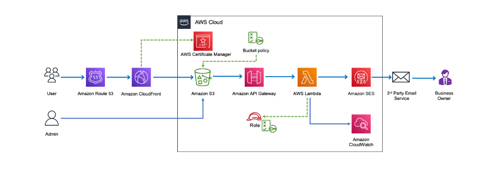

Serverless Contact Form on AWS

📌 Overview
This project demonstrates a fully serverless contact form built using AWS services.

 🏗 Architecture

🔧 AWS Services Used
- Amazon Route 53
- AWS Certificate Manager (ACM)
- Amazon CloudFront
- Amazon S3
- Amazon API Gateway
- AWS Lambda
- Amazon SES
- Amazon CloudWatch

🔄 Flow
1. User accesses website via Route 53 domain
2. CloudFront serves static content from S3
3. Form submission triggers API Gateway
4. Lambda processes request
5. SES sends email notification
6. Logs stored in CloudWatch

📄 Documentation
Step-by-step implementation is available in the Word document inside the (Serverless_ebook.docx) folder.

🚀 Outcome
- Fully serverless
- Secure HTTPS
- Scalable & cost-efficient
